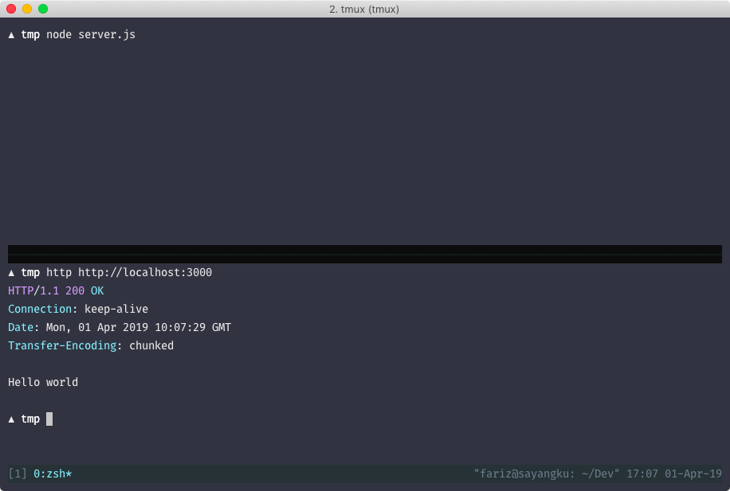

# Hello World

Sebagai pengingat: Kita tidak akan membahas apa itu Node.js.

Disini kita akan mencoba membuat menulis web server pertama kita menggunakan Node.js secara
"telanjang", tanpa framework. Kita akan mengandalkan low-level API `http` yang telah disediakan oleh
Node.js

```js
const http = require('http')
const PORT = process.env.PORT || 3000

function requestListener (req, res) {
  res.write('Hello world')
  res.end()
}

http
  .createServer(requestListener)
  .listen(PORT)
```

Silahkan jalankan kode tersebut, dan akses http://localhost:3000. Apakah akan muncul "Hello world"?



Singkatnya, kita memanggil fungsi `createServer` dan `listen` dari module `http`. Fungsi
`createServer` menerima 2 parameter, yakni:

- `options`, yang mana sebuah object array namun opsional
- `requestListener`, yang mana sebuah fungsi untuk mengatur event request tersebut

Di fungsi `requestListener` menerima 2 parameter, yakni `req` yang merepresentasikan "Request" dari
client (incoming message) dan `res` yang merepresentasikan "Response" dari server ke client (server
response).

Untuk callback dari fungsi `createServer` (yang mana disini bernama `requestListener` bisa diganti
sesuka hati kalian, dan parameter `req` dan `res` di fungsi `requestListener` pun bisa diganti
sesuai kalian. Yang penting mudah dipahami.

Pada contoh diatas, fungsi `requestListener` kita hanya mengeksekusi `write()` yaitu sebuah fungsi
untuk mengirim response ke client. Parameter dari fungsi tersebut bisa ber-tipe `string` ataupun
`Buffer`.

Lalu yang kedua kita memanggil fungsi `end()`, yang mana berguna untuk memberitahu bahwa response
headers dan body telah selesai dikirimkan ke client. Fungsi ini harus dipanggil setiap mengirim
response.

Yang ketiga, `createServer`. Bila fungsi ini dipanggil, maka nilai keluaran/return nya adalah
instace dari `http.Server`, web server kita. Untuk bisa membuat web server kita menerima request,
kita perlu memulai server tersebut menerima request kan? Maka kita panggil lah fungsi `listen`
dengan parameter nilai port yang ingin dituju.

Pada kasus ini adalah port 3000. Bila kita merequest "GET" ke localhost:3000 (yang mana localhost
adalah hostname lokal kita) menuju port 3000, maka yang ngatur request tersebut adalah web server
kita. Bisa saja kan satu hostname menjalankan berbagai server, misal port 3000 untuk aplikasi kita,
3001 untuk aplikasi lain menggunakan Ruby, lalu 8000 menggunakan Golang, whatever.

Intinya, bila ada request menuju server kita ke port 3000, maka web server kita yang mengatur. Dan
dikasus ini, request tersebut hanya menampilkan response "Hello World" secara plain.


Kita sudah menampilkan 'Hello World', sekarang mari kita ubah dari Hello World menjadi: "Hello
Node.js" dan menggunakan port: 3001


const http = null
const PORT = null


const http = require('http')
const PORT = process.env.PORT || 3001

function requestListener (req, res) {
  res.write('Hello Node.js')
  res.end()
}

http
  .createServer(requestListener)
  .listen(PORT)


assert(
  bodyInput === 'Hello Node.js' &&
  portInput === 3001
)


let bodyInput = ''
let portInput = ''

// MOCK
const Http = function () {}
const req = {}
const res = {}
const process = { env: { port: null } }

// I'm sorry dev

const require = function (module) {
  void(module)
  return new Http()
}

res.write = function (value) {
  bodyInput = value
}

res.end = function () { void 0 }

Http.prototype.createServer = function (callback) {
  if (callback) callback(req, res)
  return this
}

Http.prototype.listen = function (port) {
  portInput = port
}


## Referensi

- [`http`](https://nodejs.org/api/http.html)
- [`process`](https://nodejs.org/api/process.html)
