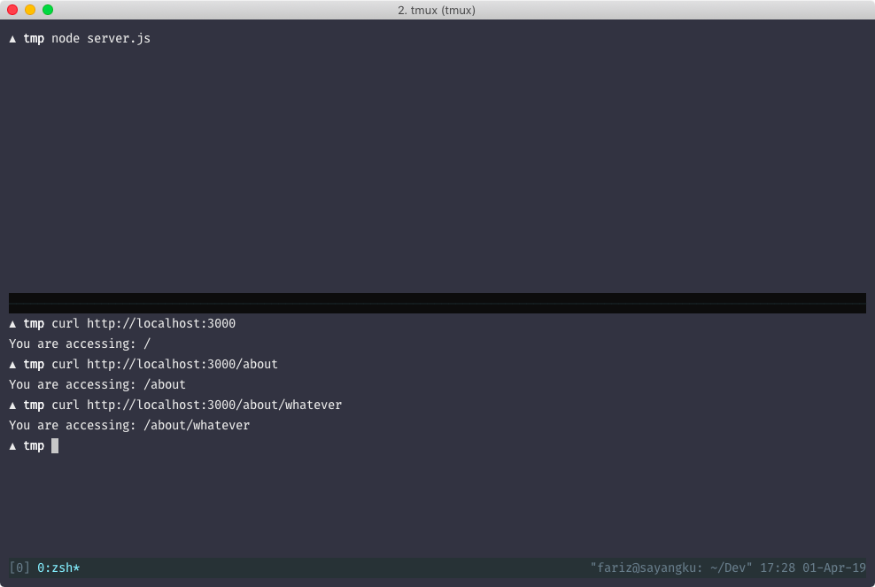
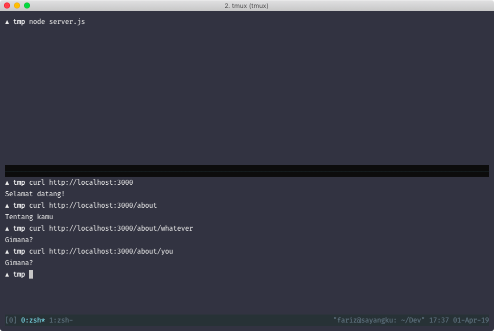
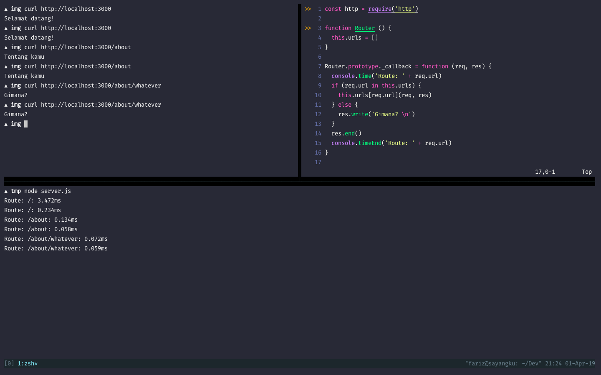

# Controller pertama kita

Disini kita akan membuat controller. Yakni, ketika user akses `/`, apa yang harus ditampilkan,
dan ketika akses `/about`, apa yang harus dilakukan.

Sebelumnya kita perlu tau dulu nih url apa yang di request oleh si pengguna, disini kita akan
mengambil nilainya dari object `req`:

```diff
function callback (req, res) {
- res.write('Hello world')
+ res.write(`You are accessing: ${req.url} \n`)
  res.end()
}
```
Sekarang mari kita eksekusi. Dan berikut hasilnya:



Url yang dituju sudah diterima, sekarang waktunya untuk "mengatur" apa yang harus dilakukan. Misal,
ketika user akses halaman `/`, tampilkan: "Selamat datang!". Bila mengakses `/about`, tampilkan:
"Tentang kamu". Selainnya, tampilkan: "Gimana?"

```javascript
const http = require('http')
const PORT = process.env.PORT || 3000

function callback (req, res) {
  const { url } = req

  if (url === '/') {
    res.write('Selamat datang!\n')
  } else if (url === '/about') {
    res.write('Tentang kamu \n')
  } else {
    res.write('Gimana? \n')
  }
  res.end()
}

http
  .createServer(callback)
  .listen(PORT)

```

Hasilnya adalah seperti ini:



Yeay kita telah membuat controller pertama kita! Lihat kan bagaimana callback mengatur route kita?
Anggap `callback` adalah top-level controller kita. Untuk karakter `\n` itu untuk menandakan "Insert new
line on that text". Agar teks yang ditampilkan lebih rapih.

Oke tujuan kita menggunakan pola MVC adalah agar lebih rapih, kan? Lihat kode diatas dan bayangkan
bagaimana bila kita memiliki 200 routes, ada berapa banyak coba kondisi if nya? Sekarang kita akan
membuat fungsi sederhana, untuk membuat controller-controller tersebut rapih dilihat.

```javascript
const http = require('http')
const PORT = process.env.PORT || 3000

function Router () {
  this.urls = []
}

Router.prototype._callback = function (req, res) {
  if (req.url in this.urls) {
    this.urls[req.url](req, res)
  }
  res.end()
}

Router.prototype.get = function (url, callback) {
  this.urls[url] = callback
}

Router.prototype.listen = function (port) {
  const server = http.createServer(this._callback.bind(this))
  return server.listen(port)
}

function handleHome (req, res) {
  res.write('Selamat datang! \n')
}

function handleAbout (req, res) {
  res.write('Tentang kamu \n')
}

function handleWhatever (req, res) {
  res.write('Gimana? \n')
}

const router = new Router()

router.get('/', handleHome)
router.get('/about', handleAbout)

router.listen(PORT)
```

Lumayan. Perlu diingat bahwa kode diatas **hanya sebagai contoh dan tidak cocok untuk digunakan di
_production_**. Hanya sebagai pembelajaran dasar tentang bagaimana membuat "abstraksi" yang tidak
direkomendasikan. Mari kita pisah logic antara aplikasi kita dengan logic dari abstraksi terhadap
web server yang kita buat tersebut.

```javascript
const http = require('http')

function Router () {
  this.urls = []
}

Router.prototype._callback = function (req, res) {
  if (req.url in this.urls) {
    this.urls[req.url](req, res)
  }
  res.end()
}

Router.prototype.get = function (url, callback) {
  this.urls[url] = callback
}

Router.prototype.listen = function (port) {
  const server = http.createServer(this._callback.bind(this))
  return server.listen(port)
}

module.exports = Router
```

Sekarang file `server.js` kita adalah seperti ini:

```javascript
const Router = require('./router')
const PORT = process.env.PORT || 3000

function handleHome (req, res) {
  res.write('Selamat datang! \n')
}

function handleAbout (req, res) {
  res.write('Tentang kamu \n')
}

function handleWhatever (req, res) {
  res.write('Gimana? \n')
}

const router = new Router()

router.get('/', handleHome)
router.get('/about', handleAbout)

router.listen(PORT)
```
Lumayan. Tapi sayangnya fungsi `handleWhatever` tidak pernah terpanggil disini. Mari kita buat
fungsi tersebut dipanggil hanya ketika kondisi ketika user mencoba merequest route yang belum kita
definisikan.

Mari kita hapus function `handleWhatever` yang menjadi callback function kita tersebut yang berguna
untuk menghandle route yang tidak kita definisikan di router logic, dan kita pindahkan langsung ke
`router` controller logic kita.

```diff
// router.js

Router.prototype._callback = function (req, res) {
  if (req.url in this.urls) {
    this.urls[req.url](req, res)
- }
+ } else {
+   res.write('Gimana? \n')
+ }
  res.end()
}

// app.js

- function handleWhatever (req, res) {
-  res.write('Gimana? \n')
- }
```

Hasil akhir dari file `server.js` kita:

```javascript
const Router = require('./router')
const PORT = process.env.PORT || 3000

function handleHome (req, res) {
  res.write('Selamat datang! \n')
}

function handleAbout (req, res) {
  res.write('Tentang kamu \n')
}

const router = new Router()

router.get('/', handleHome)
router.get('/about', handleAbout)

router.listen(PORT)

```

Rebih rapih, kan? Sekarang mari kita hasilnya. Disini saya tambahkan "response time" dari ketika
user request sampai server kita meresponse.



Not bad lah ya. Semoga sampai sini sudah mengerti sedikit tentang konsep Controller ya. Sekarang
mari kita move on ke Model! Sebelumnya, bisa coba _exercise_ dibawah terlebih dahulu.



Sekarang mari buat controller baru untuk route ke `/contact` dan tampilkan "Kontak saya".


router.get(, )


function contactController (req, res) {
  res.write('Kontak saya')
}
router.get('/contact', contactController)


assert(
  routeName === '/contact' &&
  responseBody === 'Kontak saya'
)


let routeName = ''
let responseBody = ''

// MOCK
const req = {}
const res = {}
const router = {}

res.write = function (value) {
  responseBody = value
}

function controller ($req, $res) {
  res.write($res)
}

router.get = function (route, controller) {
  routeName = route
  controller(req, res)
}


## Referensi

- [Object.prototype](https://developer.mozilla.org/en-US/docs/Web/JavaScript/Reference/Global_Objects/Object/prototype)
