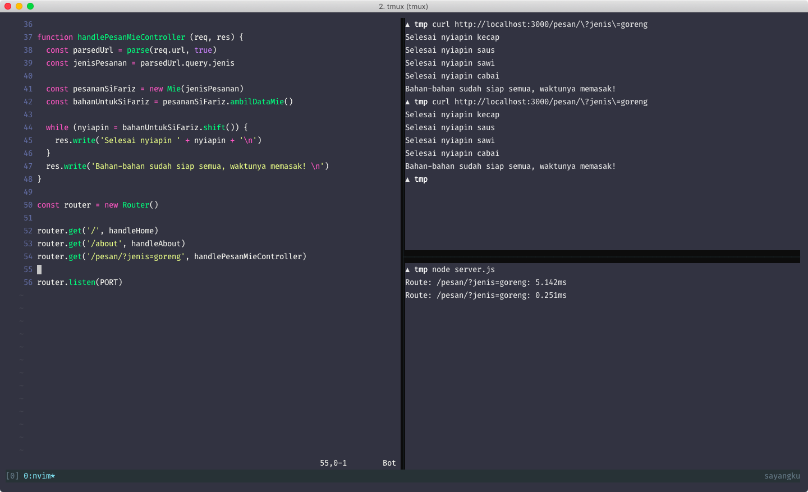

# Model pertama kita

Model adalah tentang bagaimana kita berurusan dengan data. Data apapun itu.
Tentang bagaimana kita mengatur data, tentang bagaimana berinteraksi dengan data, dan sebagainya.

Misal di dunia nyata kita bayangkan tentang bagaimana kita memesan Indomie di warkop kesayangan kita. Kita bilanglah
ke penjaga _"Mas pesan indomie goreng satu pakai telur"_. Lalu si controller (mang indomie) ngasih tau model bahwa dia
ingin membuat indomie goreng dan dia butuh data ini, ini, ini (bumbu, mie nya itu sendiri, kecap,
dsb). Setelah mendapatkan datanya, barulah dia (mang indomie) memasak air, menuangkan bumbu,
memasukkan mie ke panci, dan seterusnya.

Setelah selesai, si mang indomie akan memberikannya ke si pembeli dalam bentuk "Mie sudah jadi"
alias View yang akan kita bahas nanti.

Nah, bumbu, bahan-bahan untuk membuat mie, sampai mie nya sendiri itu adalah model. Ke yang lebih
spesifik seperti Mie goreng atau mie rebus, itu juga adalah model. Bagaimana bila kita analogikan
nya dengan kasus membuat indomie saja, ya?

## Objek

Model bisa berbentuk apa saja, biasanya dikumpulkan dalam suatu objek karena kita biasanya
membutuhkan data lebih dari satu. Dalam kasus ini, model "dasar" kita adalah Mie. Disini kita akan
menggunakan syntax `class` dari ES6 agar lebih mudah dipahami. Berikut modelnya:

```javascript
class Mie {
  constructor (jenis) {
    this.jenis = jenis
  }
}
```

Sesimple itu. Parameter nya adalah `jenis` karena kita butuh tau si user ingin memesan indomie
goreng atau rebus. Karena beda kan hasilnya juga (masa mie goreng pakai kuah?). Sekarang mari kita
"berinteraksi" dengan model tersebut.

```javascript
const pesananGue = new Mie('goreng')
```

Sudah! Tapi model tersebut tidak memberikan data apa-apa, kan? Mari kita lanjutkan untuk memberikan
data-data tersebut ke controller/mang indomie:

```javascript
const fakeDatabase = {}

fakeDatabase.query = function (query) {
  const tableBumbu = {
    goreng: ['kecap', 'saus', 'sawi', 'cabai'],
    rebus: ['kuah', 'saus', 'cabai']
  }
  const $query = query.split(' ')
  const selectedQuery = $query[7]

  return tableBumbu[selectedQuery]
}

class Mie {
  constructor (jenis) {
    this.jenis = jenis
  }
  ambilDataMie () {
    // Misal SELECT * FROM bumbu where jenis = '$jenis'
    return fakeDatabase.query('select * from bumbu where jenis = ' + this.jenis)
  }
}


```

Oke model sudah dibuat sekarang mari kita integrasikan dengan controller ya.

```javascript
const pesananSiFariz = new Mie('goreng')
const bahanUntukSiFariz = pesananSiFariz.ambilDataMie() // ['kecap', 'saus', ...]

let nyiapin

while (nyiapin = bahanUntukSiFariz.shift()) {
  console.log('Selesai nyiapin ', nyiapin)
}

console.log('Bahan-bahan sudah siap semua, waktunya memasak!')
```
Lihat bagaimana controller berkomunikasi dengan model lalu model memberikan data yang dibutuhkan
tersebut ke controller? Sekarang mari kita implementasikan di aplikasi kecil kita.



Cool! Tapi model yang kita buat dengan cara diatas tidak akan digunakan di aplikasi nyata, karena
kita pasti berinteraksi dengan "data" yang berada di database. Dan juga, biasanya data yang sudah
diterima langsung ditampilkan dalam bentuk "View" yang merepresentasikan "request" yang diinginkan
oleh client/user.

Dan bila kita melihat kode diatas, controller yang kita buat tidak meng-handle request dinamis.
Maksudnya, ketika kita ubah menjadi ke `/pesan/?jenis=rebus`, maka yang muncul adalah `Gimana?`,
karena kita tidak membuat controller untuk menghandle route itu ataupun tidak menghandle routing
tersebut secara dinamis. Namun untuk sekarang kita skip terlebih dahulu, agar fokus ke model.

Pada bahasan ini kita tidak ada excercise dulu ya. Karena membahas model terlalu "abstrak".

## Referensi

- [Class syntax-sugar (ES6)](https://developer.mozilla.org/id/docs/Web/JavaScript/Reference/Classes)
