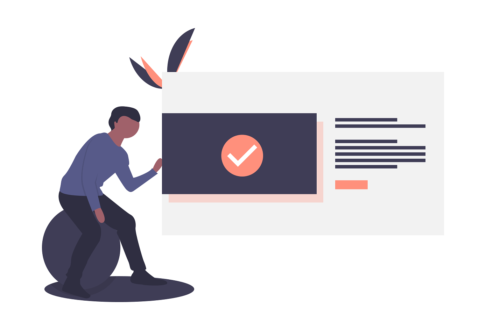

# Rekapitulasi

Kita sudah membuat aplikasi sederhana kita menggunakan Web server kita sendiri yang langsung
berinteraksi dengan low-level API seperti `http` dan `url` yang sudah disediakan di Node.js.
Tanpa lapisan diatasnya, mungkin hanya "sedikit" abstraksi yang kita buat untuk proses "registrasi" route ber-tipe GET yang ingin kita handle secara deklaratif.

Yang kita buat tersebut masih telanjang, murni, vanilla, tanpa pemanis yang ditawarkan oleh framework. Tentu
kita akan menggunakan framework yang sudah ada demi menghindari "Reinventing the wheel". Tujuan kita
berinteraksi dengan low-level API tersebut adalah "setidaknya" kita tau bagaimana framework (nanti) tersebut
bekerja "under the hood" meskipun tidak sesuai dengan apa yang kita buat. Dan pastinya, framework
tersebut pun sama-sama memanggil methods `createServer` dan `listen` dari module `http` yang kita
gunakan juga.

## Mengapa menggunakan framework?

Battle-tested. Production-grade. Don't reinvent the wheel. Ecosystem-ready. Get it?

## Are you 'pessimist', riz?

Gak. Bukan gitu. Kita bisa saja kan menulisnya secara murni tanpa pemanis framework. Berinteraksi dengan
module `http` langsung, dengan module database driver yang kita gunakan langsung, dsb. Tapi lihat, masalah apa yang sebenarnya
ingin kita selesaikan? Masalah di framework? Masalah di adapter database yang kita gunakan?

Overengineering.

Melainkan, kita akan mencoba menyelesaikan masalah "manusia" menggunakan "komputer". Ya, tujuan utama adanya komputer adalah untuk
mempermudah pekerjaan manusia, kan? Agar proses pembuatannya lebih cepat, efektif, efisien, dapat diandalkan, kita akan menggunakan alat-alat
yang sudah dibuat, digunakan, diuji, dan dipelihara oleh orang lain. Yang biasa kita sebut sebuah framework/library.

---

- Sumber kode chapter 0: https://glitch.com/edit/#!/vivid-train
- Sumber kode chapter 0 (versi dipisah): https://glitch.com/edit/#!/unequaled-memory
- Demo chapter 0: https://vivid-train.glitch.me

Di chapter selanjutnya kita akan mulai membuat project kita.
