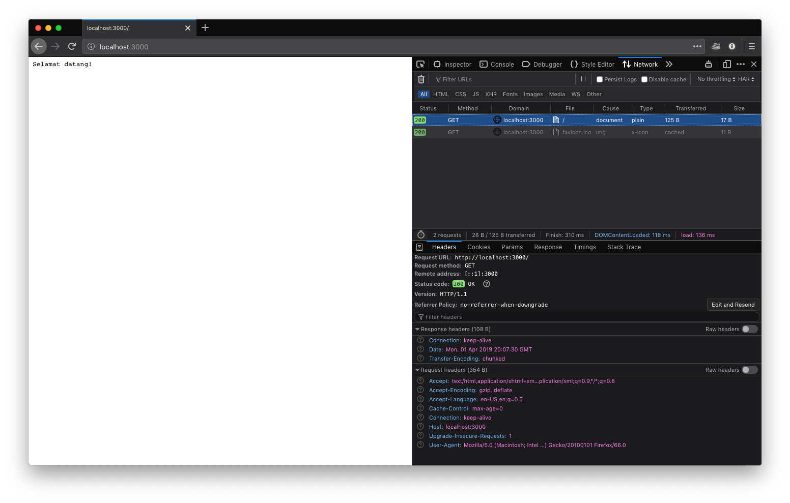
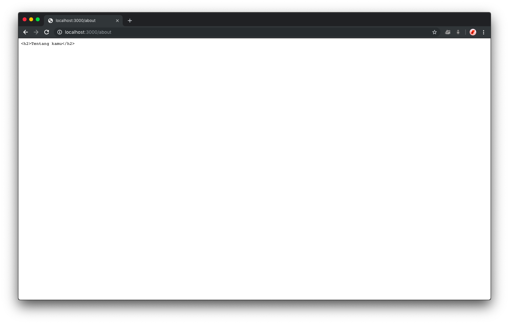
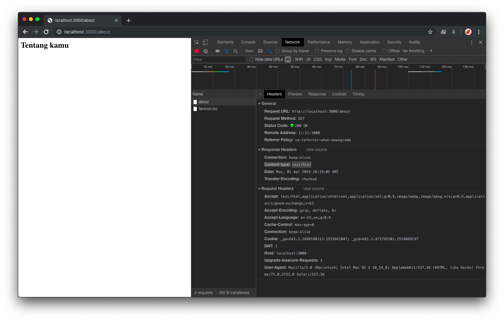
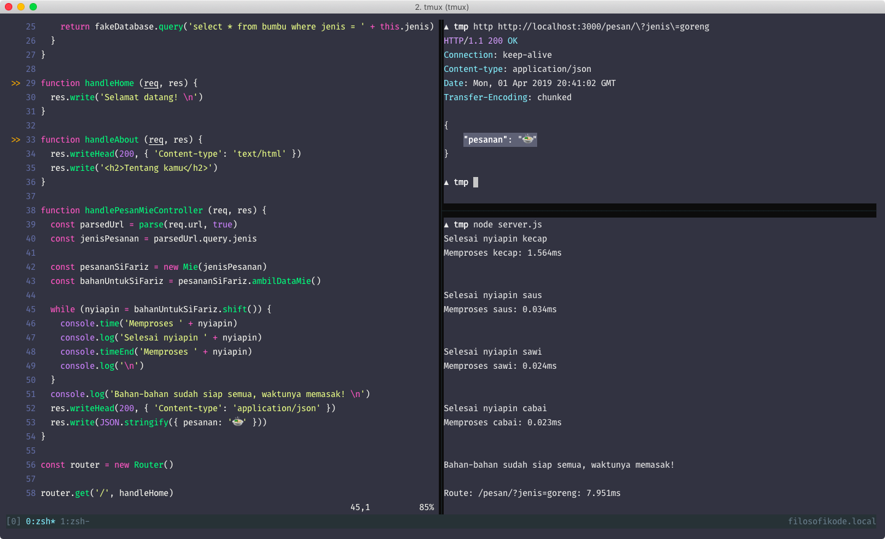

# View pertama kita

View adalah tentang bagaimana kita menampilkan data tersebut. Dalam bentuk apapun, yang penting
merepresentasikan akan data yang direquest. Bisa berbentuk dokumen HTML ataupun JSON yang nanti
dikonsumsi oleh file html kita via AJAX.

Disini kita akan membuat 3 jenis view: Plain text, HTML, dan JSON. Plain text untuk view `/`, HTML
untuk view `/about`, dan JSON untuk view `/pesan/?jenis=goreng`. Let's go!

## Plain text

Response sebelumnya adalah berbentuk plain text. Bisa dilihat di browser via "Devtools" seperti
gambar dibawah ini.



Jadi kita tidak perlu membuat contoh kode untuk ini ya.

## HTML

Sekarang mari kita menggunakan tag `<h2>` untuk menampilkan "Tentang kamu" dengan element heading
level 2. 

```diff
function handleAbout (req, res) {
-  res.write('Tentang kamu \n')
+  res.write('<h2>Tentang kamu</h2>')
}

```

Hasilnya adalah ini:



Hmm, tidak sesuai dengan yang kita harapkan. Mengapa ini terjadi? Karena kita tidak secara
"eksplisit" memberitau browser bahwa type content ini adalah "html". Saya menggunakan browser Chrome
diatas adalah karena Firefox "by default" menampilkannya dengan format content html tanpa secara
eksplisit diberitahu browser. Sekarang mari kita buat untuk kasih tau browser/client bahwa konten
tersebut ber-tipe HTML.

Caranya adalah dengan memberikan response header yang memiliki kunci "Content-type" yang bernilai
"text/html". Yang sebelumnya (yang `/`) adalah bertipe "text/plain".

```diff
function handleAbout (req, res) {
+ res.writeHead(200, { 'Content-type': 'text/html' })
  res.write('<h2>Tentang kamu</h2>')
}
```

Dan berikut hasilnya:



Ok cool. Sangat ambisius. Sekarang kita ke JSON

### JSON

JSON merupakan singkatan dari JavaScript Object Notation. Yang mana formatnya adalah seperti object
yang ada di JavaScript. Pada contoh kasus di routing `/pesan/?jenis=goreng`, kita (sebagai user)
ber-ekspektasi untuk mendapatkan hasil "Mie" kan? Mari kita buat.

Jika sebelumnya kita memberikan response header dengan content-type text/html, untuk JSON
content-type nya adalah application/json. Disini juga kita melakukan tracking response time untuk
mengetahui berapa waktu yang dihabiskan untuk memprosesnya.

```javascript
  while (nyiapin = bahanUntukSiFariz.shift()) {
    console.time('Memproses ' + nyiapin)
    console.log('Selesai nyiapin ' + nyiapin)
    console.timeEnd('Memproses ' + nyiapin)
    console.log('\n')
  }
  console.log('Bahan-bahan sudah siap semua, waktunya memasak! \n')
  res.writeHead(200, { 'Content-type': 'application/json' })
  res.write(JSON.stringify({ pesanan: '🍲' }))
```

Hasilnya adalah seperti ini:



Not bad. Biasanya, klien bisa mengkonsumsinya dengan misal seperti ini:

```javascript
fetch('http://localhost:3000/pesan/?jenis=goreng')
  .then(res => res.json())
  .then(data => {
    this.pesananSaya = data.pesanan
  })
```

Dan itu adalah urusan anak frontend ya haha. Disinipun kita tidak akan excercise, karena terlalu
"Visual".

## Referensi

- [`console.time() dan console.timeEnd()`](https://developer.mozilla.org/en-US/docs/Web/API/console#Timers)
- [`fetch()`](https://developer.mozilla.org/en-US/docs/Web/API/Fetch_API)
- [`JSON`](https://developer.mozilla.org/en-US/docs/Web/JavaScript/Reference/Global_Objects/JSON)
