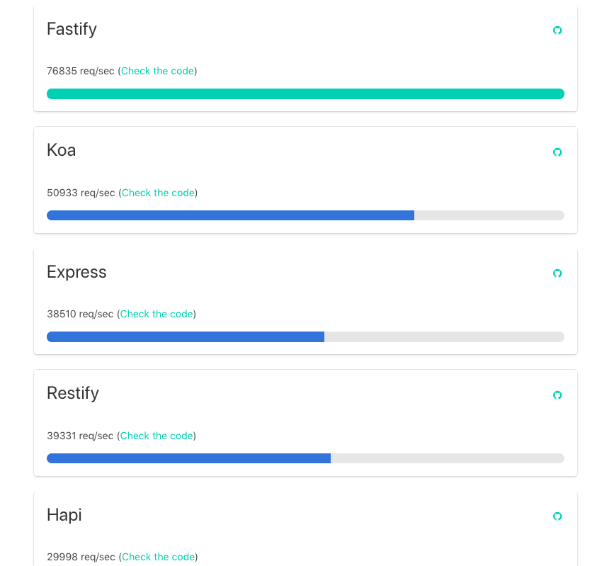
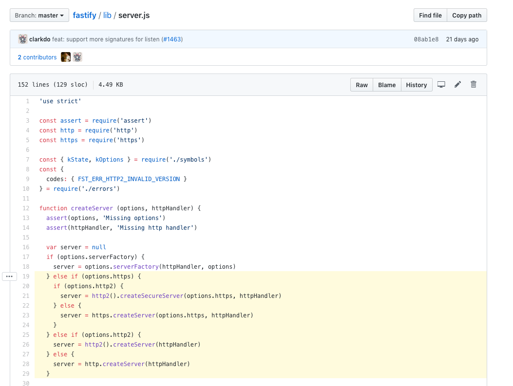

# Apa dan Mengapa Fastify?

Sebelum masuk ke topik pembahasan, mari kita megingat ulang sedikit yang kita bahas di chapter 0.
Salah satunya adalah tentang bagaimana kita "meregister" route yang kita punya:

```javascript
router.get('/', someController)
router.get('/about', anotherController)
router.get('/profile', stillTheController)
```

Terlihat normal, namun bukankah methods yang ada di HTTP tidak hanya GET? Ada POST, UPDATE, DELETE,
PUT, PATCH, dsb? Belum lagi untuk mengatur route yang dinamis. Atau nested routes.

Mungkin bisa saja kita _tinggal_ menulisnya dari awal. Tapi, ngapain?

Kan sudah ada framework yang memiliki fitur tersebut. Sudah teruji, terpelihara, dan dapat
diandalkan.

## Apa itu Fastify?

Let me introduce you this ambitious framework, Fastify. Sebuah Web Framework yang memfokuskan
di optimasi pengalaman pengguna pengembang dengan "biaya" terendah. Plus, dirancang untuk modular.
Mengapa ada kata "biaya" terendah? Karena [setiap abstraksi ada
biayanya](https://medium.com/@108kb/tentang-cost-of-abstractions-41f858b51859), dan kita harus membayar
hutang tersebut sebelum nanti kita menjadi angel investor of technical debt pada aplikasi kita.

Fastify adalah framework yang "closer to metal", jadi apa yang kita pelajari di chapter 0
(yang langsung berinteraksi dengan low-level API `http`) akan kita temui juga disini.

Dan juga karena "closer to metal", bisa diasumsikan Fastify cepat. Sorry, bukan asumsi. Ini ada
datanya meskipun hanya sekedar "Hello World" haha.



Fitur lain yang ditawarkan adalah schema-based, logger, dan extendible (+ didukung oleh
komunitasnya yang luas). Beberapa yang kita butuhkan seputar teknologi sudah tersedia, jadi kita
bisa lebih fokus ke hal lain seperti pemecahan masalah ataupun marketing.

## Mengapa Fastify?

Mengapa bukan Express? Atau Hapi? Koa? Dsb?

Dalam memilih suatu teknologi, biasanya saya mempertimbangkan 5 hal:

- Pasar
- Ekosistem
- Kompleksitas
- Kapabilitas
- Reliabilitas

Yang pernah saya tulis di Medium yang berjudul [Bahasa pemrograman apa yang harus saya
pelajari/gunakan](https://medium.com/juniordev-life/bahasa-pemrograman-apa-yang-harus-saya-pelajari-gunakan-36faa93628e2) yang
mana saya gunakan untuk memilih bahasa program yang ingin dipelajari oleh pemula.

Mengapa memilih Fastify adalah karena poin nomor 2 s/d 5 yang memang memenuhi kebutuhan saya.
Meskipun poin 1 belum memenuhi, justru disini saya mengambil kesempatan untuk mencoba lebih memperkenalkannya
kepada developer khususnya di Indonesia.

Saya memiliki love-hate relationship dengan opinionated batteries included framework seperti Rails,
Django, dan sebagainya. Meskipun memang _mempercepat_ proses development, tapi kita harus
mempelajari luar dalam seputar framework tersebut meskipun mungkin **tidak harus semua** terlebih
dahulu.

Sayangnya, tidak semua developer yang tertarik untuk mempelajari lebih dalamnya. Ada beberapa yang
terlalu terlena dengan "getting things done" nya sampai lupa di fundamentalnya baik terkait dengan
framework tersebut atau bahkan sampai ke bahasa program yang digunakan oleh framework tersebut. Gak
perlu ngomongin data structure lah ya.

Dengan memilih Fastify, bisa diasumsikan kita bisa menyelesaikan sesuatu dengan cepat tanpa
melupakan kenyataan bahwa ada abstraksi yang perlu kita ketahui, karena kita berhadapan dengannya.



Bahkan file "entry point" nya pun langsung bergantung dengan methods `createServer` baik dari
module `http`, `https`, bahkan `http2`. So close.

## What the hell is with abstractions?

Daritadi kita ngebahas tentang abstraksi, memang ada apa sih dengan abstraksi? Mengapa juga harus
peduli detail dari suatu yang kompleks dan sengaja disembunyikan tersebut?

Begini, kita mungkin tidak perlu tau detailnya tentang bagaimana DNS bekerja. Tapi bagaimana bisa
kita mengefektifkan angka latensi bila kita tidak tau bagaimana fundamentalnya DNS? Tentang caching? TTL?
Sama seperti kita tidak perlu tau bagaimana internet bekerja, tapi hei lihatlah orang-orang yang gak
tau "fundamental" nya tentang internet ketika berhadapan dengan masalah-masalah seputar internet.

Berbicara tentang "fundamental" sebetulnya implisit. Apakah tentang "inti" nya? "Mendasar" nya?
Prinsip nya? Atau, apanya? Misal seperti yang senior developer sering katakan tentang fundamentalnya
programming, data structures. Jika kita terus mendalami sampai ke dasarnya, mungkin dibawah data
structures ada lapisan lain. Hmm, arsitektur komputer? Assembly?

_Kan ada batasannya, riz. Ada tingkat nya sampai mana kita perlu mengetahui suatu detail!_

Benar. Saya setuju. Karena kita bicara tentang framework, maka kita harus tau level-level abstraksi dari
framework tersebut misalnya. Ambil contoh [hapi](https://github.com/hapijs/hapi), yang memiliki 3 level:

- index.js
- server.js
- core.js
- `http`

Yang maksudnya bila kita menggunakan dependency dari `hapi`, class-class inti yang ada di file diataslah yang
akan kita hadapi.

## Mengapa harus peduli?

Gini, aneh gak sih bila kita ingin menggunakan sesuatu tapi kita tidak tau cara kerja dan _behavior_ nya? Bayangkan ketika
kita menggunakan motor, dan kita tidak perlu tau cara kerja motor seperti apa. Tidak ada yang salah, sampai ketika
terjadinya masalah tersebut.

## Ringkasan

Agar tidak hilang fokus, berikut poin-poin tentang apa dan mengapa Fastify:

- Web Framework that focused on DX with least overhead
- It fast, has great ecosystem, and battle-tested
- Extendible
- Built-in logging support
- Closer to metal

Dihalaman selanjutnya kita akan mencoba menulis test skenario sederhana di Fastify.
