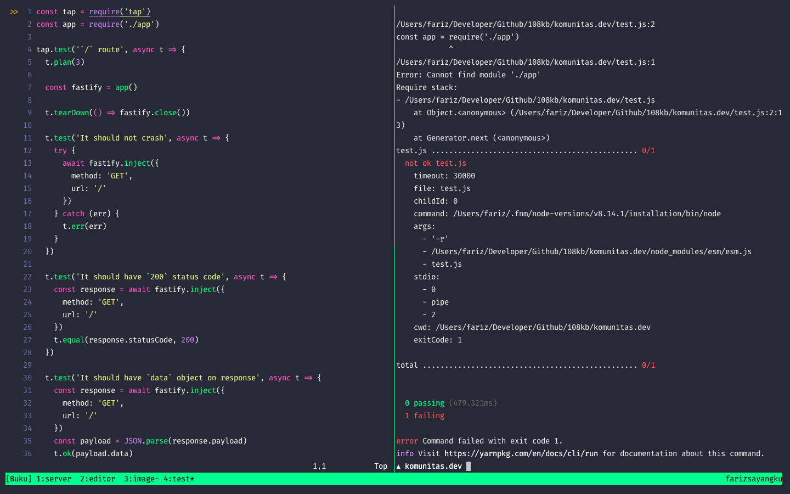
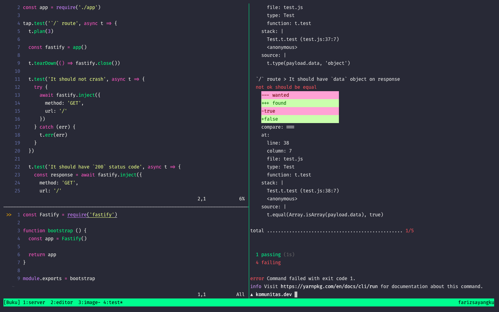
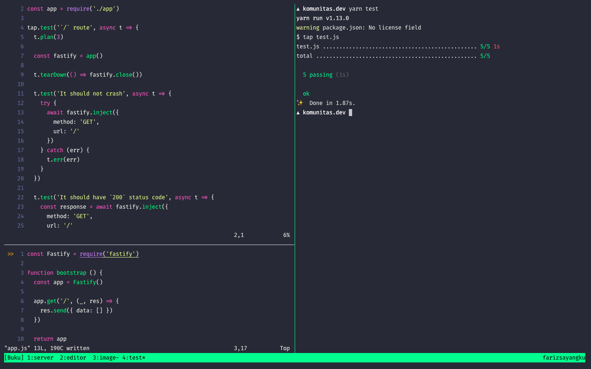

# Menulis Unit Test

Menulis test penting selain untuk tetap menjaga _behavior_ akan perubahan yang terjadi pada
aplikasi kita, juga untuk "meyakinkan" diri kita akan pemahaman tentang kode yang kita tulis. Juga
mempermudah developer lain dalam memahami aplikasi yang kita buat.

Unit test merupakan bagian terkecil dari software testing, yang mana kita akan menguji hal-hal dasar
yang berkaitan dengan karakteristik fungsionalitas tersebut. Seperti, misalnya bila spesifikasi fungsi
`homeController` adalah:

- Tidak ada fatal error
- Halaman harus memiliki status code 200
- Harus memberikan response object `data` yang bertipe array

Maka 3 karakteristik diatas harus terpenuhi. Atau mungkin setidaknya beberapa harus terpenuhi
tergantung test yang ditulis oleh seorang ehm developer.

## Unit Test di Fastify

Kita akan menggunakan module [tap](https://github.com/tapjs/node-tap) untuk menguji aplikasi kita.
Silahkan baca `README.md` untuk lebih mempelajari tentang mengapa menggunakan `tap`.

Juga, di Fastify mendukung methods `inject`. Jadi kita bisa menguji aplikasi kita (yang mana setiap
fitur direpresentasikan oleh endpoint) tanpa perlu benar-benar mengakses endpoint tersebut. Yang
artinya, tidak ada "server yang berjalan" ketika kita menguji fitur tersebut.

Cool.

Sekarang mari kita menginstall dependensi yang diperlukan terlebih dahulu yakni `fastify` dan `tap`.

```bash
yarn add fastify && yarn add tap --dev
```

Lalu buat file bernama `test.js`, yang mana harus memiliki spesifikasi yang sama dengan daftar yang
sudah kita tulis diatas.

```javascript
const tap = require('tap')
const app = require('./app')

tap.test('`/` route', async t => {
  t.plan(3)

  const fastify = app()

  t.tearDown(() => fastify.close())

  t.test('It should not crash', async t => {
    try {
      await fastify.inject({
        method: 'GET',
        url: '/'
      })
    } catch (err) {
      t.err(err)
    }
  })

  t.test('It should have `200` status code', async t => {
    const response = await fastify.inject({
      method: 'GET',
      url: '/'
    })
    t.equal(response.statusCode, 200)
  })

  t.test('It should have `data` object on response', async t => {
    const response = await fastify.inject({
      method: 'GET',
      url: '/'
    })
    const payload = JSON.parse(response.payload)

    t.ok(payload.data) 
    t.type(payload.data, 'object')
    t.equal(Array.isArray(payload.data), true)
  })
})
```

Tambahkan script `test` ke `package.json` kita:

```json
{
  "scripts": {
    "test": "tap test.js"
  }
}
```

Dan mari kita jalankan test tersebut dengan mengeksekusi `yarn test`. Ajaib bila tidak error.



Ok cool, mari kita buat file `app.js` agar test tersebut berhasil.

```javascript
const Fastify = require('fastify')

function bootstrap () {
  const app = Fastify()

  return app
}

module.exports = bootstrap
```



Ok keren, test pertama kita sudah berhasil. So wasting time ya? Tunggu sampai aplikasi kita nanti
sudah besar.

Sekarang mari kita buat test ke-2 dan 3 berhasil dengan cara: Menerima response kode 200 (berarti
harus memiliki route dan menerima resonse body dengan object `data` yang bertipe array `[]`).

```javascript
const Fastify = require('fastify')

function bootstrap () {
  const app = Fastify()

  app.get('/', (req, res) => {
    res.send({ data: [] })
  })

  return app
}

module.exports = bootstrap
```



Cool.
